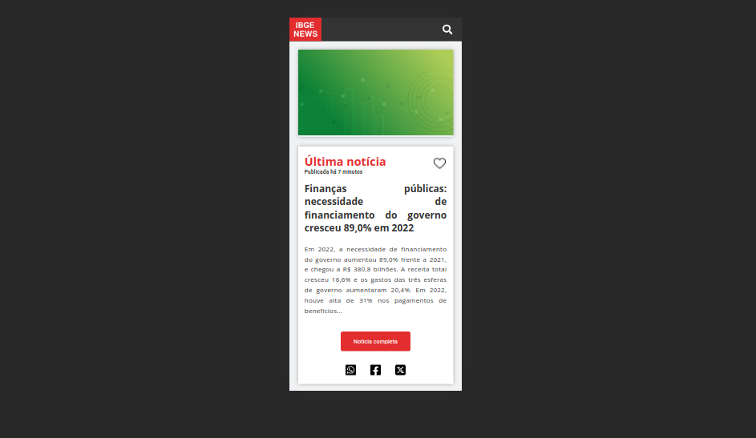
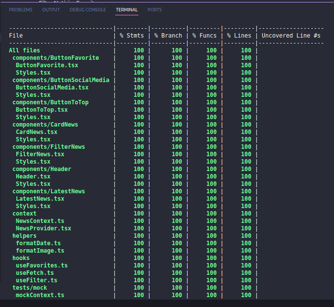

# IBGE News Front-end

O IBGE News é um front-end desenvolvido para divulgação das informações mais recentes fornecidas pela API gratuita do Instituto Brasileiro de Geografia e Estatística (IBGE). Este aplicativo oferece uma interface intuitiva e diversas funcionalidades para facilitar o acesso e a busca por notícias relevantes.

Link do deploy: https://app-ibge-news.vercel.app/

# Instalação

Para instalar o aplicativo, siga os seguintes passos:

Clone o repositório usando o comando:

  - git clone git@github.com:rafaelmagalhaesguedes/IBGENewsFront.git

Navegue até o diretório do projeto:

  - cd IBGENewsFront

Instale as dependências necessárias usando:
    
  - npm install

Inicie o aplicativo em modo de desenvolvimento:
    
  - npm run dev

# Telas

### Desktop

### Mobile

# Funcionalidades

- Filtra Notícias Mais Recentes:
  
  - Visualize as notícias mais recentes fornecidas pela API do IBGE.

- Filtra Notícias Mais Antigas:
  
  - Acesse notícias mais antigas para obter informações históricas.

- Filtra Notícias por Tipo:
  
  - Explore notícias categorizadas por tipo para uma busca mais específica.

- Filtra Notícias Favoritas:
  
  - Marque notícias como favoritas para acesso rápido posteriormente.

- Busca Notícias na Base de dados:

  - Utilize a funcionalidade de busca para encontrar notícias específicas com facilidade.

# Cobertura de testes

# Tecnologias Utilizadas

- ReactJS
  - React Testing Library
  - Styled Components
  - Custom Hooks
  - Context API

- TypeScript/JavaScript

- CSS Flexbox

- Git e GitHub para versionamento

- Vercel para deploy

- VSCode

# Contribuição

Sinta-se à vontade para contribuir com melhorias, correções de bugs ou novas funcionalidades. Abra uma issue para discussão antes de enviar um pull request.

# Author

Rafael Magalhães Guedes
